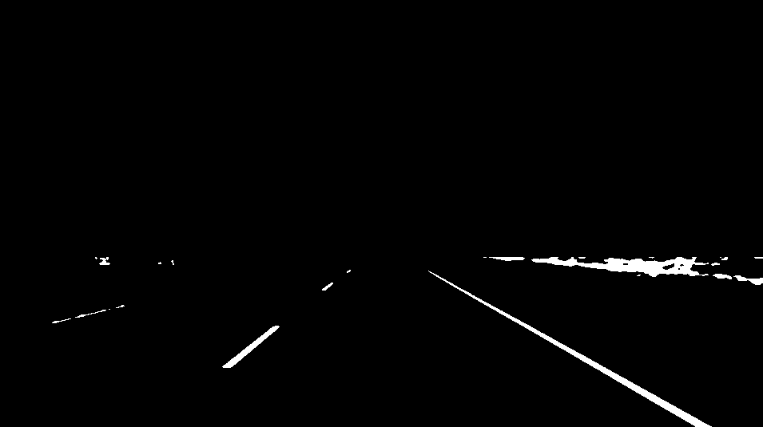
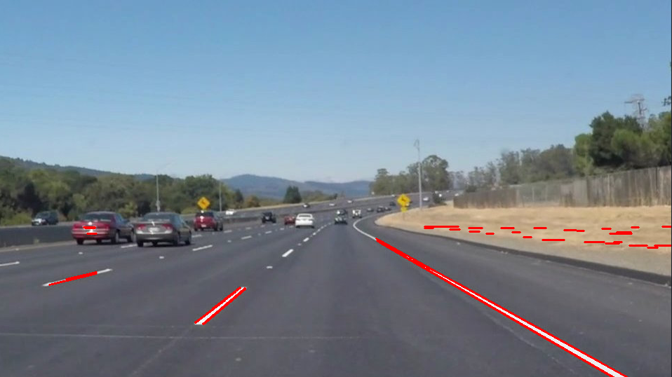

<!-- https://github.com/adam-p/markdown-here/wiki/Markdown-Cheatsheet#code -->
# **P1 - Finding Lane Lines on the Road** 

### **Description**

When we drive, we use our eyes to decide where to go. The lines on the road that show us where the lanes are act as our constant reference for where to steer the vehicle.  Naturally, one of the first things we would like to do in developing a self-driving car is to automatically detect lane lines using an algorithm. This project detect lane lines in images/videos using Python and OpenCV. I used the tools that I learned about in the lesson (Computer Vision Fundamentals) to identify lane lines on the road.

---

### **Used Methods**

The tools that I used are color space (HSV and HLS), region of interest selection, gray scaling, Gaussian smoothing, Canny Edge Detection and Hough Transform line detection. To achieve the goal was piece together a pipeline to detect the line segments in the image/video, averaging/extrapolating them and draw them onto the image/video for display. 

---

### **How to run**
To run the pipeline just run in a prompt the command:

```clear && python2 CarND-P1-Finding_Lane_Lines.py```

You can change process variables like:	    
* folder_results &nbsp;= &nbsp;"./results" # Results/output folder where results will be saved  
* folder_dir_image &nbsp;= &nbsp;"./test_images"  # folder with images to process  
* folder_dir_video  &nbsp;= &nbsp;"./test_videos" # folder with videos to process  
* Tune_ranges &nbsp;= &nbsp;False # Enable/Disable parameters tuning (shows a window to tune color space model values for thresholding)  
* Save_results &nbsp;= &nbsp;True # Enable/Disable results saving (write images and videos in folder_results)  

Tested on: python 2.7 (3.X should work), OpenCV 3.0.0 (Higher version should work), UBUNTU 16.04.

---

### **Code Description**

I decided to explore my own methods and write all functions from scratch, so no given function was used or modified for this project. The code ```CarND-P1-Finding_Lane_Lines.py``` is well documented, but here I resume the process to achieve the goal of left and right lane lines detection.

**Step 0**: &nbsp;I decided to use a dual color space HSV to get a binary image with our objects of interest (White lane lines and Yellow lane lines). Setting a maximum and a minimum value for each parameter H (Hue), S (Saturation), and V (Value), then compile, see result, adjust and try again is bothersome, so I coded a simple tuner window for this. Using the function ```color_range_tunner```  you can load stetted parameters and set new values for an image. So, I tuned the color ranges for white and yellow lane lines (white_conf_hsv.npz and yellow_conf_hsv.npz). If you decide don't tune up any parameter, this function loads the parameters saved and return their values (from a npz file). It’s possible to tune parameters for a different color space instead of HSV like HLS o others supported by OpenCV. I only played with the HSV space, but HLS could work as well.

Let's work we this image:


*Figure 1 - Original image*  
    
The color space tunning window is:

  

*Figure 2 - Color space tunning window*  

You can move the track bars and choose the ranges that you like most. With my chosen ranges let’s see how the main function ```find_lanelines``` finds and returns the right and left lane lines. 

Considere the next **input arguments**:  
* img_src: &nbsp;`cv2.math` &nbsp;- input image to find and approximate left and right lane lines  
* COLOR_TRESH_MIN: &nbsp;`list` &nbsp;- Minimum parameters to color thresholding  
* COLOR_TRESH_MAX: &nbsp;`list` &nbsp;- Maximum parameters to color thresholding  
* COLOR_MODEL: &nbsp;`list` &nbsp;- Color space in cv2 interface to color thresholding  
* VERT_TRESH: &nbsp;`float` &nbsp;- Normalized value to ignore vertical image range  
* FILT_KERN: &nbsp;`int` &nbsp;- (odd) size/kernel of filter (Bilateral)  
  
**Setp 1**: &nbsp;The first thing is smooth the image with a bilateral filter with a kernel size given by “FILT_KERN”, but, why i bilateral filter? well, this kind of filters can reduce unwanted noise very well while keeping edges fairly sharp, but they are very slow compared to most filters. Is necessary the filter? Yes, because we want reduce small particles o noise for next steps.

  

*Figure 3 - Smoothed Image with bilateral filter*  
  
**Setp 2**: &nbsp;From our tunned parameters for white and yellow color we'll get a binary mask from every color space tunned (COLOR_TRESH_MIN, COLOR_TRESH_MAX, COLOR_MODEL), then apply a logical operator (OR) to combine every mask and compose just one image like in the picture bellow. In every mask, the image area above the threshold VERT_TRESH (image height normalized value) is ignored, in few words this is because we dont care the sky and others objects above this horizontal limit.

  

*Figure 4 - Binary image from color thresholding*  
  
**Setp 3**: &nbsp;The image above looks great to apply a canny edge detector to get only contours from the binary mask. No matter what parameters are given since our image is a binary mask, so changes are gonna be to strong to be detected with any values (X and Y grandients): 

  

*Figure 5 - Contours by Canny edge detection algorithm*  
  
**Setp 4**: &nbsp;Applying the Probabilistic Hough Line function we get the result shown in Figure 6. Setting the correct parameters to get these lines is about experience o just play for a while to get a decent result. The problem now is we have undesirable red lines in some scenarios, so the the question now is how do we distinguish what lines we want?, and what lines belong to the right and left side of the road ? I will explain it to you next.   



*Figure 6 - Probabilistic Hough Line algorithm* 
  
**Setp 5**: &nbsp;A

  

*Figure 7 - Hough Lines filtered and assigned with heuristic*
  
**Setp 6**: &nbsp; The answer to the last question is heuristic. If the vehicle is properly centered in the road, the left and right lane lines always intersect the image in the bottom, and lines that we don't want intersect the image on the left and right side, the unwanted lines also have small angles close to 0. or 180. degrees, so, with some conditionals we can take only the lines that belong to the left and right lane lines. Finally to get just one line per side, we compute a simple linear regression with left and right lines coordinates. 
  
Finally the function **Returns**:
* Lm: `float`  linear regression slope of left lane line
* Lb: `float`  linear regression y-intercept of left lane line
* Rm: `float`  linear regression slope of right lane line
* Rb: `float`  linear regression y-intercept of right lane line  
* Left_Lines: `list` list of left lines with which left lane line was calculated
* Right_Lines: `list` list of right lines with which right lane line was calculated
  
If no left or right lane line is detected function returns the parameters Lm, Lb, Rm, and Rb as None type

  

*Figure 8 - Result of lane lines finding process*  
  
**Setp 7**: &nbsp; having the detected left and right lane line we have achieved the goal, but in videos there's an issue and is that we have a pair of lines in every frame (image), and now the question is: what happens if one of these lines get lost, disappear or change position due to the noise or light conditions changing in the frame?, the answer is that our lines will be noisy changing their slope and intersection fast, so I coded a class called ```LaneLine```. 

In videos when lines are detected are passed to the ```LaneLine``` variable to be assigned and associated. This variable takes for every frame in its function ```associate_regresion``` the current/input line and average it with the previous ones. This leads to smooth changes of left and right lane lines through all video.

To show results the function ```draw_lanelines``` overlies the result image over the original with transparency, the blue lines were used to calculate right and left lane lines regression. If the long lines in each side of the road are green indicate that lines are currently detected, otherwise will be red colored (line lost).

Result with test videos here:  

1. [CarND-P1-Finding_Lane_Lines-solidYellowLeft_Video](https://www.youtube.com/watch?v=vOMT9DGa2Bw)  
2. [CarND-P1-Finding_Lane_Lines-solidWhiteRight_Video](https://www.youtube.com/watch?v=1VgXQWhJjMw)  
3. [CarND-P1-Finding_Lane_Lines-challenge_video](https://www.youtube.com/watch?v=IY_yvBPCamc)  
  
---
  
### **Potential Shortcomings**
  
* Light conditions changing: Maybe one the first problems in computer vision is light conditions changing in the scene. Parameters values could work in certain light conditions but if you change the location, day hour of your video, maybe some functions like color thresholding, canny, hough lines detector, and others wont give you the result that you want. Solve this kind of problems with classic computer vision is really hard. You can see something similar in video ```CarND-P1-Finding_Lane_Lines-challenge_video```, when a shadow of a tree produce  an abrupt change in the slope of detected lane lines.

*  White and Yellow Objects: If an object in scene appear and has the same or similar color of lane line will be segmented in the binary mask, and maybe due its geometry some lines could be included in the linear regression calculation and this could lead to a bad or wrong lane line approximation.

---
  
### **Possible Improvements**
  
* Measure distance between lane lines. 
* Measure curvature of lane lines.
* Adaptive color space thresholding values for light condition changing.

---
  
> **Date:** &nbsp;02/20/2019  
> **Programmer:** &nbsp;John A. Betancourt G.  
> **Phone:** &nbsp;+57 (311) 813 7206 / +57 (350) 283 51 22  
> **Mail:** &nbsp;john.betancourt93@gmail.com / john@kiwicampus.com  
> **Web:** &nbsp;www.linkedin.com/in/jhon-alberto-betancourt-gonzalez-345557129  

<!-- Sorry for my English -->